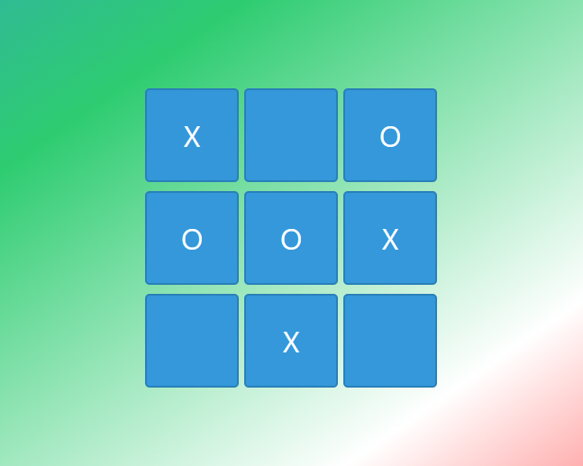

# Tic-Tac-Toe Game

A simple and interactive Tic-Tac-Toe game implemented using HTML, CSS, and JavaScript.



## Features

- Play against a computer opponent with a minimax algorithm.
- Responsive design for a seamless experience on various devices.
- Restart the game at any time.

## Demo

Check out the [live demo](link-to-your-demo) to play the game.

## How to Play

1. Open the game in your web browser.
2. Click on an empty cell to make your move.
3. The computer will make its move using the minimax algorithm.
4. Continue taking turns until a player wins or the game ends in a tie.
5. Restart the game using the "Restart Game" button.

## Installation

1. Clone the repository to your local machine:

    ```bash
    git clone https://github.com/gmpsankalpa/tic-tac-toe-web-game.git

2. Clone the repository to your local machine:

    ```bash
    cd tic-tac-toe-web-game

3. Open the [index.html] file in your web browser.

## License
This project is licensed under the [MIT](LICENSE) License.

---

<div align="center">

   
   
   
   

</div>